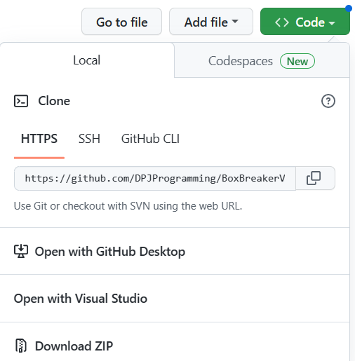
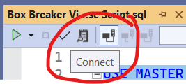
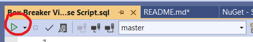
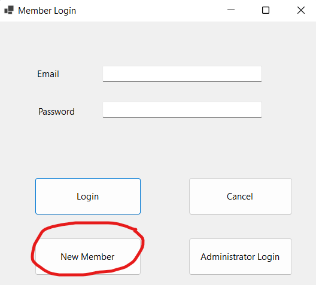
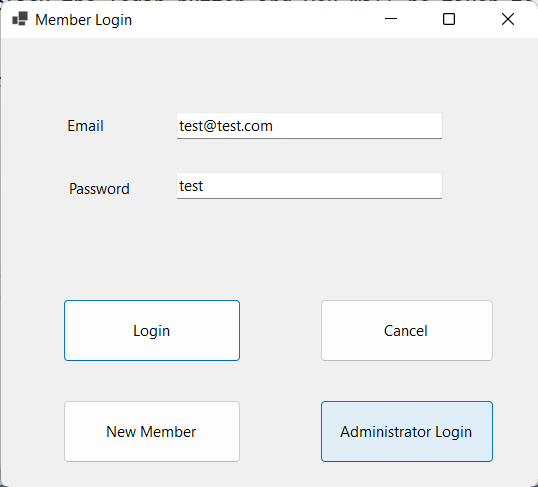
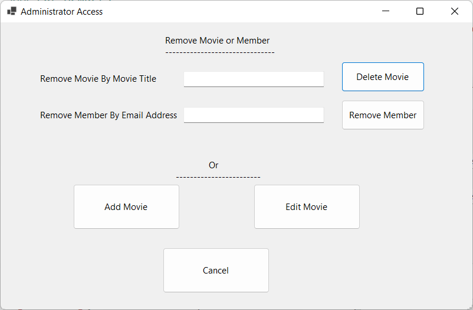

# BoxBreakerVideo
A movie rental app using Windows Forms .NET

## Dependencies
- Visual Studio
- .Net 6.0
- Windows Operating System
#### NuGet Packages
- Microsoft.EntityFrameworkCore.Design
- Microsoft.EntityFrameworkCore.SqlServer
- Microsoft.EntityFrameworkCore.Tools

## Features
- CRUD functional forms to manipulate data in a database
- Login Form to access the Movie Rental or Admin Forms
- Movie Rental Form to choose which movies to rent
- Summary form which shows chosen movies and price to checkout
- New member form to create an account
- Admin form allows for deleting a member or movie
- add/edit movie forms adds a new movie or edits an existing one

## Instructions
### Install Database
1. Clone Repository to your local drive.

2. Open the Box Breaker Video Database Script and Connect to your local host (MSSQLLocalDB) and run the script.

The database will now be on your computer.

- Press play button to run the app.

### For Members 
1. If your new, click New Member button, otherwise skip to step 3.
(Alternitavely you can enter "test@test.com" for email and "test" for password to bypass this step.)

2. Fill in all information correctly and click Register

3. Fill in the login information you just made and click the login button and you will be taken to the Rental Form.

4. Pick a movie you want to rent from the drop down menu and click add to order.

5. When you are done with your selections click the checkout button. You will be taken to your order summary.

6. Congrats! You have rented some awesome movies!!! (No guarantee of actually getting real movies)

### For Administrator
1. To login as an administrator, your email address must be from test.com

2.From the Admin form you can delete members and movies by title.

3.From the admin form you can also click the add movie button to enter information for a new movie to be added,
or click the edit button to edit the information of a movie which already exists in the database.